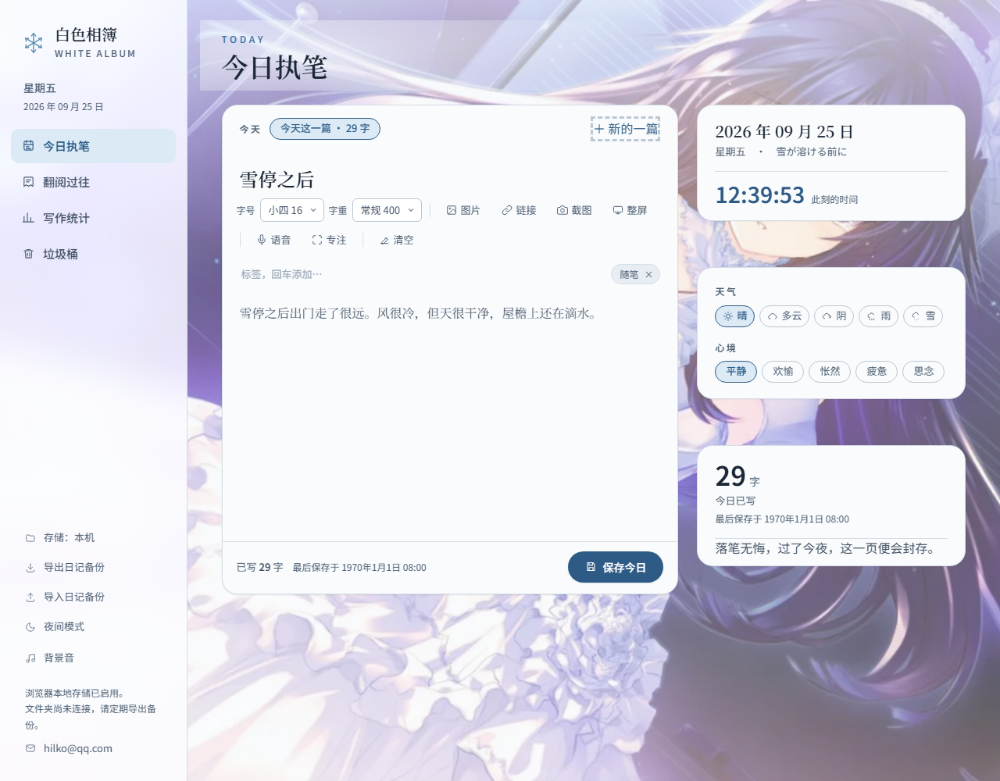
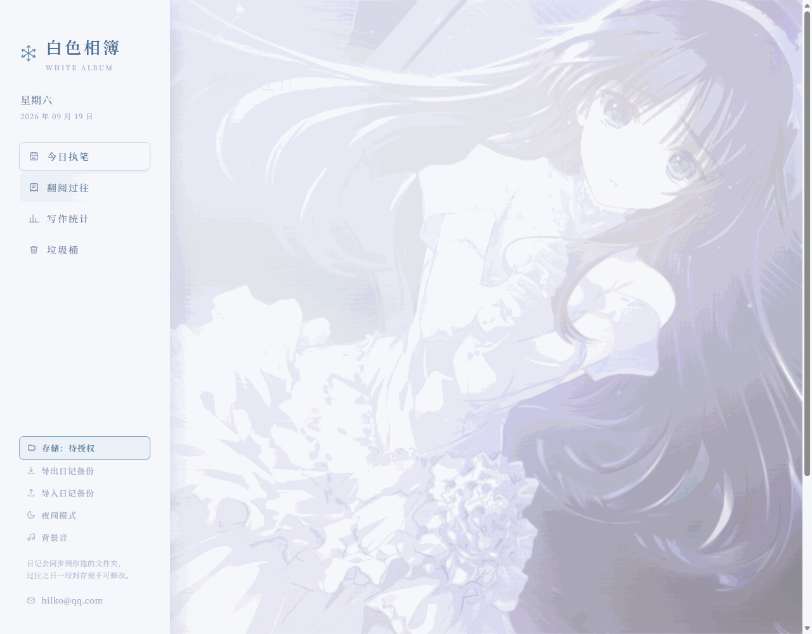
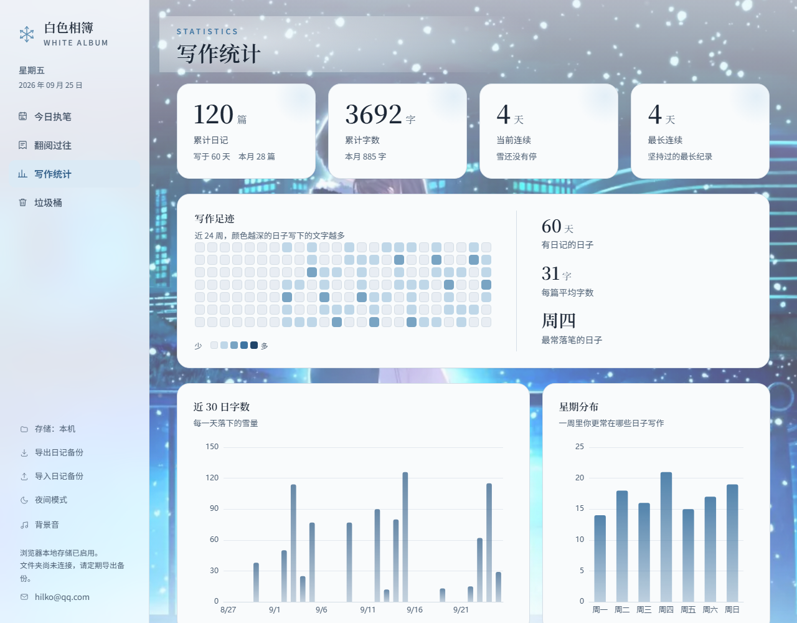
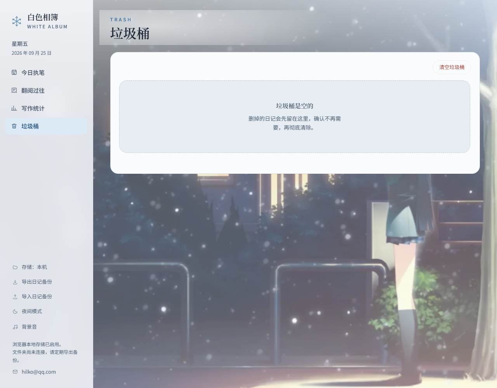
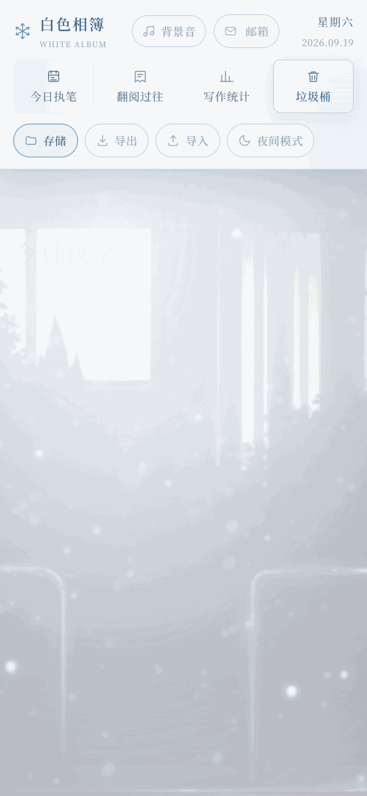

<div align="center">

# 白色相簿 · White Album Diary

**一本只属于你自己的日记本：纯前端、单文件，数据全部留在本地。**
**A quiet diary that lives entirely in your browser — one HTML file, no backend, no account.**

[中文说明](#中文说明) · [English](#english) · [在线体验 Online Demo](https://pasitearko.github.io/white-album-diary/)




</div>

## 截图 / Screenshots

<table>
  <tr>
    <td width="50%"></td>
    <td width="50%"></td>
  </tr>
  <tr>
    <td align="center">翻阅过往 · 搜索 / 标签 / 月历 / 阅读器</td>
    <td align="center">写作统计 · 热力图与图表</td>
  </tr>
  <tr>
    <td></td>
    <td align="center"></td>
  </tr>
  <tr>
    <td align="center">垃圾桶 · 可还原、可彻底删除</td>
    <td align="center">移动端 · 顶栏重排 + 触屏适配</td>
  </tr>
</table>

---

# 中文说明

## 这是什么

《白色相簿》是一本跑在浏览器里的日记本。整个应用只有一个 `index.html`：不用安装、不用命令行、不用构建，双击就能写；没有服务器、没有账号，写下的内容默认只留在你自己的浏览器里。

视觉上沿用《WHITE ALBUM 2》的白与冰蓝：思源宋体、落雪、壁纸与背景音。它想做的不是「效率工具」，而是一个安静的角落——今天可以慢慢写，写下的会封存，只可重读。

## 功能特性

### 写作

- **一天可以写多篇**：同一天点「＋ 新的一篇」即可再开一篇，顶部以胶囊切换（第 1 篇 / 第 2 篇…）
- **落笔无悔**：过了今夜，这一页会封存，只可重读，不可更改
- **草稿自动保存**：标题（40 字）与正文（最多 20000 字）在输入时自动存，实时字数统计
- **标签**：回车添加自定义标签，列表页可按标签筛选
- **天气与心境**：晴 / 多云 / 阴 / 雨 / 雪，以及 平静 / 欢愉 / 怅然 / 疲惫 / 思念
- **图片附件**：选图后自动压缩（最长边 1200px、JPEG 82%）再存入 IndexedDB，支持灯箱放大
- **链接**：把网页链接插入正文，阅读页可直接点击
- **语音输入**：调用浏览器语音识别（Chrome / Edge）
- **专注模式**：全屏沉浸写作，Esc 退出
- **清空**：当前这一篇会先进垃圾桶，不会凭空消失

### 排版

- **正文字号** 7 档：小五 12 / 五号 14 / 小四 16 / 四号 18 / 小三 20 / 小二 24 / 二号 28
- **正文字重** 7 档：200 – 900
- 写作区与阅读区共用同一套设置，选择会记在本地；字体用**思源宋体可变字体**，每一档字重都是真字重，而不是浏览器猜出来的伪粗

### 翻阅过往

- **全文搜索**：标题、正文、标签
- **标签筛选** + **月历**：有日记的日子会标出来
- **阅读器**：上一篇 / 下一篇翻页，图片、链接、标签一并呈现

### 写作统计

- 四张卡片：累计日记、累计字数、当前连续、最长连续
- 近 24 周**写作足迹热力图**，颜色越深代表那天写得越多
- 近 30 日字数、星期分布（ECharts 柱状图）、月度汇总表

### 垃圾桶

- 删除的日记先进垃圾桶，可以**还原**、可以**彻底删除**，也可以一键清空

### 数据

- **导出 / 导入 JSON 备份**
- **本地文件夹同步**（Edge / Chrome）：授权一个文件夹后，每次保存都会顺带写成 `白色相簿日记.json`、按日期分文件的 `日记/YYYY-MM-DD.md`，图片放进 `日记/images/`；换电脑时把这个文件夹带走即可
- **夜间模式**

### 工具

- **一键成图**：把当前这一篇导出成 PNG 长图
- **截图标注**：内置微信式编辑器——框选、画笔、箭头、矩形、椭圆、文字、马赛克，支持撤销 / 重做 / 复制到剪贴板
- **整屏截图**：截取整个屏幕或某个窗口（走浏览器屏幕共享权限）

### 氛围

- **背景音**：After All〜綴る想い〜 (Inst.)（WHITE ALBUM 2 OST）或 Rainy Mood 雨声，带音量条；触屏设备上点唱片先展开面板，再点播放 / 暂停
- **壁纸随视图切换**：今日执笔按日期在日常 / CG 之间轮换，翻阅过往是小镇静景，写作统计是夜空，垃圾桶是那张专用的
- **落雪与浮光**：Canvas 绘制的雪花，跟随窗口尺寸重排；页面切到后台会暂停，并尊重系统的「减少动态效果」设置

## 快速开始

**在线用**：直接打开 <https://pasitearko.github.io/white-album-diary/>

**本地用**：把仓库下载下来，双击 `index.html`。壁纸和唱片封面是同目录的图片文件，所以别只把 html 单独拿走。

**部署自己的**：Fork 本仓库 → Settings → Pages → Source 选 `Deploy from a branch` → 分支 `main`、目录 `/ (root)` → 保存，几十秒后就能拿到自己的地址。

## 数据与隐私

- 没有服务器、没有账号、没有埋点：日记正文、标签、图片、主题与排版偏好都存在你自己的浏览器里
- 存储分工：`localStorage` 存日记与偏好，`IndexedDB` 存图片，文件夹同步是可选的额外一份
- 清理浏览器数据、换浏览器或换电脑都会丢失，建议定期「导出日记备份」，或者连接一个本地文件夹让每次保存自动落盘
- 语音输入与整屏截图需要浏览器授权（麦克风 / 屏幕共享），只在点击的那一刻请求

## 技术栈

| 层面 | 选型 |
| --- | --- |
| 界面 | 原生 HTML / CSS / JavaScript，无框架、无构建 |
| 排版 | 思源宋体可变字重（Fontsource CDN） |
| 图表 | [ECharts](https://echarts.apache.org/) 5.5.1 |
| 长图导出 | [html2canvas-pro](https://github.com/yorickshan/html2canvas-pro) 2.4.3 |
| 存储 | localStorage · IndexedDB · File System Access API |
| 托管 | GitHub Pages |

## 项目结构

```
white-album-diary/
├── index.html              整个应用：HTML + CSS + JS 全部在这里
├── wallpaper-day.jpg       壁纸 · 日常（今日执笔，与 CG 按日期轮换）
├── wallpaper-cg.jpg        壁纸 · CG（今日执笔，与日常按日期轮换）
├── wallpaper-town.jpg      壁纸 · 小镇（翻阅过往）
├── wallpaper-night.jpg     壁纸 · 夜空（写作统计）
├── wallpaper-trash.jpg     壁纸 · 垃圾桶
├── cover-introductory.jpg  唱片封面 · 背景音乐
├── cover-rain.svg          唱片封面 · 雨声
├── docs/                   README 用截图
└── README.md
```

## 浏览器兼容

| 浏览器 | 情况 |
| --- | --- |
| Edge / Chrome（桌面） | 全部功能可用 |
| Safari / Firefox | 写作、阅读、统计正常；文件夹同步不可用（需要 File System Access API），语音输入与整屏截图取决于浏览器实现 |
| 手机浏览器 | 响应式布局 + 触屏交互适配（顶栏重排、背景音面板改为点击展开） |

## 常见问题

**换了电脑，日记怎么不见了？**
日记存在浏览器本地，需要先在旧设备「导出日记备份」，再在新设备「导入」；用过文件夹同步的话，直接在新设备重连同一个文件夹也可以。

**背景音点了没反应？**
音乐是网易云外链、雨声来自 Rainy Mood，都需要联网；浏览器也要求先有用户交互才允许播放。手机上的静音开关同样会拦住它。

**手机上看到的还是旧版？**
GitHub Pages 有缓存，下拉刷新或强刷一次。

**点「存储」提示不支持？**
文件夹同步需要桌面版 Edge / Chrome。其它浏览器请用「导出日记备份」手动存盘。

## 更新记录

- **2026-09-19** 正文排版升级：字号 / 字重下拉选择器，改用真正的思源宋体可变字重
- **2026-09-16** 移动端重构：顶栏重排、触屏交互、垃圾桶壁纸

## 许可证

本项目采用 [MIT License](LICENSE)：可以自由使用、修改、分发，包括商业用途，只需保留版权声明。许可证只覆盖**代码**；壁纸、唱片封面与音乐素材的版权归原作者，不在授权范围内。

## 致谢与声明

- 名字与图片来自《WHITE ALBUM 2》，音乐版权归 AQUAPLUS 所有，本项目是出于热爱的非商业的个人练习
- 雨声来自 [Rainy Mood](https://rainymood.com/)
- 字体为思源宋体（SIL Open Font License 1.1）；图表 [ECharts](https://echarts.apache.org/)（Apache-2.0）、长图导出 [html2canvas-pro](https://github.com/yorickshan/html2canvas-pro)（MIT）
- 壁纸与封面图片来自网络，版权归原作者所有，仅供个人学习与欣赏，请勿商用
- 反馈与建议：hilko@qq.com

---

# English

## What is this

White Album is a diary that runs entirely in your browser. The whole app is a single `index.html`: nothing to install, no build step, no command line — just open the file. There is no server and no account, and everything you write stays on your own machine by default.

Visually it follows the white-and-ice-blue mood of *WHITE ALBUM 2*: a serif Chinese typeface, falling snow, wallpapers and background music. It is not meant to be a productivity tool, but a quiet corner — you can take your time today, and once the day is over, the page is sealed and only readable.

## Features

### Writing

- **Multiple entries per day** — start another one with “＋ New entry” and switch between them from the pills at the top
- **Sealed days** — once the day has passed, that page becomes read-only. Past days can be re-read, not rewritten
- **Draft autosave** — title (40 chars) and body (up to 20,000 chars) are saved as you type, with a live word count
- **Tags** — add custom tags with Enter and filter the archive by them
- **Weather & mood** — sunny / cloudy / overcast / rain / snow, and calm / joyful / wistful / tired / missing
- **Image attachments** — photos are compressed in the browser (max edge 1200px, JPEG 82%) and stored in IndexedDB, with a lightbox viewer
- **Links** — insert a URL into the body; it stays clickable in the reader
- **Voice input** — via the browser speech recognition API (Chrome / Edge)
- **Focus mode** — full-screen writing, `Esc` to leave
- **Clear** — clearing an entry moves it to the trash instead of deleting it outright

### Typography

- **Font size**, 7 steps (12 / 14 / 16 / 18 / 20 / 24 / 28 px)
- **Font weight**, 7 steps (200 – 900)
- Writing and reading views share one setting, remembered locally. The typeface is a **variable-weight Noto Serif SC**, so every weight is a real weight rather than a synthetic bold.

### Archive

- **Full-text search** across titles, bodies and tags
- **Tag filter** plus a **month calendar** marking the days you wrote
- **Reader** with previous / next navigation, rendering images, links and tags

### Statistics

- Four cards: total entries, total words, current streak, longest streak
- A **24-week writing heatmap** — the darker the day, the more you wrote
- Words over the last 30 days, weekday distribution (ECharts) and a monthly summary table

### Trash

- Deleted entries go to the trash first: restore them, delete them for good, or empty the trash at once

### Your data

- **Export / import a JSON backup**
- **Folder sync** (Edge / Chrome): pick a local folder once and every save also writes `白色相簿日记.json`, a per-day `日记/YYYY-MM-DD.md`, and images into `日记/images/` — carry that folder to another machine and you are done
- **Dark mode**

### Tools

- **Export as image** — turn the current entry into a long PNG
- **Screenshot editor** — a built-in annotation tool: crop, pen, arrow, rectangle, ellipse, text and mosaic, with undo / redo and copy-to-clipboard
- **Screen capture** — grab the whole screen or a single window through the browser's screen-sharing permission

### Atmosphere

- **Background audio** — *After All〜綴る想い〜 (Inst.)* from the WHITE ALBUM 2 soundtrack, or rain from Rainy Mood, with a volume slider. On touch devices, tapping the disc opens the panel first, then plays / pauses.
- **Wallpapers that follow the view** — the writing view alternates between two by date, the archive uses a quiet town, statistics uses a night sky, and the trash has its own
- **Snow and drifting light** — drawn on a canvas, re-seeded on resize, paused while the tab is hidden, and skipped entirely under `prefers-reduced-motion`

## Getting started

**Use it online**: <https://pasitearko.github.io/white-album-diary/>

**Use it locally**: download the repository and open `index.html`. The wallpapers and album covers are image files sitting next to it, so keep the folder together.

**Deploy your own**: fork this repository → Settings → Pages → Source: `Deploy from a branch` → branch `main`, directory `/ (root)` → save. Your own URL is ready in under a minute.

## Data & privacy

- No server, no account, no analytics: entries, tags, images, theme and typography settings all live in your own browser
- `localStorage` holds entries and preferences, `IndexedDB` holds images, and folder sync is an optional second copy on your disk
- Clearing browser data, switching browsers or switching computers will lose everything — export a backup regularly, or connect a local folder so every save lands on disk
- Voice input and screen capture ask the browser for permission (microphone / screen share) only at the moment you click

## Tech stack

| Layer | Choice |
| --- | --- |
| UI | Vanilla HTML / CSS / JavaScript — no framework, no build |
| Typography | Noto Serif SC, variable weight (Fontsource CDN) |
| Charts | [ECharts](https://echarts.apache.org/) 5.5.1 |
| Image export | [html2canvas-pro](https://github.com/yorickshan/html2canvas-pro) 2.4.3 |
| Storage | localStorage · IndexedDB · File System Access API |
| Hosting | GitHub Pages |

## Project layout

```
white-album-diary/
├── index.html              the entire app: HTML + CSS + JS
├── wallpaper-*.jpg         wallpapers (day / CG / town / night / trash)
├── cover-introductory.jpg  album cover for the background music
├── cover-rain.svg          album cover for the rain sound
├── docs/                   screenshots used by this README
└── README.md
```

## Browser support

| Browser | Notes |
| --- | --- |
| Edge / Chrome (desktop) | Everything works |
| Safari / Firefox | Writing, reading and statistics work; folder sync is unavailable (needs the File System Access API), and voice input / screen capture depend on the browser |
| Mobile browsers | Responsive layout with touch-specific behaviour (rearranged top bar, tap-to-open audio panel) |

## FAQ

**My entries are gone after switching computers.**
Entries live in the browser, so export a backup on the old machine and import it on the new one — or reconnect the same synced folder.

**The background audio does not start.**
The music is streamed from NetEase and the rain from Rainy Mood, so it needs a network connection; browsers also require a user interaction before playing audio. The silent switch on phones will block it too.

**My phone still shows the old version.**
GitHub Pages caches aggressively — pull to refresh or hard-refresh once.

**“Storage” says it is not supported.**
Folder sync needs desktop Edge / Chrome. Elsewhere, use “export backup” to save manually.

## License

Released under the [MIT License](LICENSE) — free to use, modify and distribute, including commercially, as long as the copyright notice is kept. The license covers the **code** only; the wallpaper, cover art and music remain the property of their original authors and are not covered by it.

## Credits

- Name and mood inspired by *WHITE ALBUM 2*; the music belongs to AQUAPLUS. This is a non-commercial personal practice project.
- Rain sound from [Rainy Mood](https://rainymood.com/)
- Typeface: Noto Serif SC (SIL Open Font License 1.1); charts by [ECharts](https://echarts.apache.org/) (Apache-2.0); long-image export by [html2canvas-pro](https://github.com/yorickshan/html2canvas-pro) (MIT)
- Wallpaper and cover images come from the internet and remain the property of their original authors; they are included for personal, non-commercial use only
- Feedback and suggestions: hilko@qq.com
